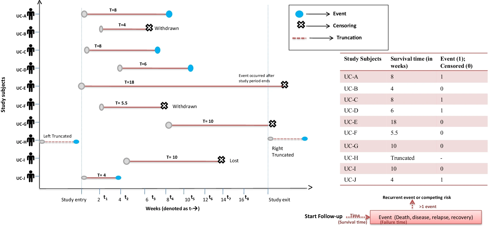

```{r, include = FALSE, echo = FALSE, wanring = FALSE, message= FALSE}
library(tidyverse)
library(broom)
library(ggdist) # logistic regression plot
theme_set(theme_classic(base_size = 16))
set.seed(12345)
```

# Learning objectives

## Learning objectives

* **Conduct** analysis on time-to-event outcomes
  * Kaplan-Meier curve, proportional hazards regression
* **Describe** issues related to time-to-event analysis
  * Censoring, proportional hazards, time-varying predictors

# Time-to-event outcomes

## Time-to-event variable

* Also called survival, time to survival, time to failure, event history analysis, reliability analysis
* **Non-negative** (only 0 and positive numbers)
* **Right skewed** with long right tail
* Potentially **censored**
  * Event is not observed *during the study*
  * Don't know if/when event happens

## Censoring

* **Right censoring**: Event has not occurred by the end of the observation period
  * Follow patients for 1 year, some patients are still alive at end
* **Left censoring**: Time started before the study started
  * Recruit cancer patients, but diagnosis occurred some period of time before the study started
* **Interval censoring**: Event occurred between two discrete observation periods, but you don't know exactly when
  * Treat time as discrete or continuous?
   
## Censoring



* From Rai et al. (2021)

## Data for censoring

* Two variables **together** define the outcome
  * **Time-to-event variable**
    * If event happened, time until event
    * If event didn't happen, time until withdrawal or end of study
  * **Censoring variable** 
    * If event happened: 1
    * If event didn't happen: 0 (censored)
    * Example: coded 1/2 for ["historical" reasons](https://cran.r-project.org/web/packages/survival/refman/survival.html#lung)


## Data

* `cancer` dataset in **survival** package
* n = 228 observations on 10 variables
  * `inst`:	Institution code
  * `time`:	Survival time in **days**
  * `status`:	censoring status 1=censored, 2=dead
  * `age`:	Age in years
  * `sex`:	Male=1 Female=2
  * `ph.ecog`:	ECOG performance score as rated by the physician. 0=asymptomatic, 1= symptomatic but completely ambulatory, 2= in bed <50% of the day, 3= in bed > 50% of the day but not bedbound, 4 = bedbound
  * `ph.karno`:	Karnofsky performance score (bad=0-good=100) rated by physician
  * `pat.karno`:	Karnofsky performance score as rated by patient
  * `meal.cal`:	Calories consumed at meals
  * `wt.loss`:	Weight loss in last six months (pounds)

```{r}
library(survival)
data(cancer)
table(cancer$status)
```


# Survival curves

## Survival object

* `Surv()` function from **survival** package
* Combines time-to-event variable and censoring variable
  * Number is survival time
  * 63 are censored: Alive (`status` = 1) at end of study (`+`)
  * 165 are not: Dead (`status` = 2) at end of study (No `+`)

## Survival object

```{r}
s <- Surv(cancer$time, cancer$status)
s
```

## Survival curve

* Unconditional survival curve **using the survival object**
  * `survfit()` function from **survival** package
  * `~ 1` means "intercept only" or "mean only": **No predictors**
  * `n` = total number of observations
  * `events` = total number **dead** at end of study
  * `median`, LCL, UCL for survival time (in **days**)

```{r}
survfit(s ~ 1)
```

## Survival curve

* Can also specify the survival object *within* the `survfit()` function
  * Same results
  * This is useful to build on, adding predictors

```{r}
survfit(Surv(time, status) ~ 1, data = cancer)
```

## Life table (/ risk table)

* `summary()` on survival curve object gives a **life table**
  * `time` = time-to-event variable values
  * `n.risk` = number still alive at this point
  * `n.event` = number of events (i.e., deaths)
  * `survival` = proportion of sample still alive at this time

```{r}
sfit <- survfit(Surv(time, status) ~ 1, data = cancer)
summary(sfit)
```

## Kaplan-Meier curve

* Life table is unmanageable with many time values
  * Hard to interpret
* Kaplan-Meier is a **graphical representation** of the life table
  * Simplest: Use `plot()` on survival curve (base R)
  * Better option: `ggsurvfit()` function in **ggsurvfit** package

## Kaplan-Meier curve

```{r}
library(ggsurvfit)
ggsurvfit(sfit)
```

## Kaplan-Meier curve

```{r}
ggsurvfit(sfit) +
  add_confidence_interval() + add_risktable()
```

## Kaplan-Meier curve is **ggplot** object

```{r}
#| code-fold: true
ggsurvfit(sfit) +
  add_confidence_interval() +
  geom_vline(xintercept = 365, linetype = "dashed", color = "blue") +
  geom_vline(xintercept = 730, linetype = "dashed", color = "blue") +
  labs(x = "Time (days)") +
  theme_classic(base_size = 16)
```

## Probability of surviving to some time

```{r}
summary(survfit(Surv(time, status) ~ 1, data = cancer), times = 365)
```

* 65 still alive, 121 have died
* Accounts for **censoring**

## Probability of surviving to some times

```{r}
summary(survfit(Surv(time, status) ~ 1, data = cancer), times = c(365, 730))
```

* 1 year: 65 still alive, 121 have died so far
* 2 years: 13 still alive, 38 have died since 365 days

## Compare two groups: Log-rank test

* `survdiff()` function in **survival** package
* Compare how many **events** in each group

```{r}
survdiff(Surv(time, status) ~ sex, data = cancer)
```

* `N` = total number in each group (here, `sex`)
* `Observed` = number of dead (`status` = 2)   

## Double check the numbers

```{r}
#| code-fold: true
sex_by_status <- table(cancer$sex, cancer$status)
rownames(sex_by_status) <- c("Male", "Female")
colnames(sex_by_status) <- c("Censored", "Dead")
sex_by_status
```

* 112 and 53 are the number of **deaths** in each group
* Report $\chi^2$ test:
  * $\chi^2(1) = 10.3, p<.001$ 
  * Significant test: Number of events **different** for males vs females
  * NS test: Number of events **same** (statistically) for males vs females

## Kaplan-Meier curve: Groups

```{r}
sfit2 <- survfit(Surv(time, status) ~ sex, data = cancer)
ggsurvfit(sfit2)
```

## Kaplan-Meier curve: Groups

```{r}
ggsurvfit(sfit2) +
  add_confidence_interval() + add_risktable()
```

# Cox regression

## Cox regression

* Also known as **proportional hazards** model 
* Extends *survival curves* to include **multiple predictors and/or continuous predictors**
  * K-M or log-rank is a $t$-test, Cox regression is linear regression
  * Model-based with statistical tests, not just *descriptive*
* Can be considered a **generalized linear model** but often excluded

## Cox regression

$$log(h(t)) = log(h_0(t)) + b_1 X_1 + b_2 X_2 + \cdots + b_p X_p$$

* Hazard = instantaneous event (death) rate at time $t$
  * $h(t)$ = hazard as a function of time $t$
  * **Function** of $t$
* $h_0(t)$ = baseline hazard **function** = hazard as a function of $t$ when all predictors equal 0
  * Like intercept, but it's a **function** of $t$

## Cox regression

* `coxph()` function from **survival** package
  * `Surv(time, status)` (survival object) is outcome
  * Variables to the right of `~` are predictors
  * `data` for the analysis
  * **Really similar** to `lm()` and `glm()`

```{r}
#| eval: false
coxph(Surv(time, status) ~ sex, data = cancer)
```

## Cox regression

```{r}
cox1 <- coxph(Surv(time, status) ~ sex, data = cancer)
summary(cox1)
```

## Interpretation

$$log(h(t)) = log(h_0(t)) \color{OrangeRed}{- 0.531 sex}$$

* **Coefficient** for a predictor
  * $b_1 = -0.531, s.e. = 0.1672, z = -3.176, p<.01$
* **Hazard ratio** for a predictor
  * $e^{b_1} = e^{-0.531} = 0.588$ w CI: $[0.4237,0.816]$
  * 1 unit change in `sex`: **Hazard** is **multiplied by** 0.588
  * Women (`sex` = 2) vs men (`sex` = 1): 58.8% of the risk of **death**
  * Flip the groups: `exp(-coef)` = 1.701 in output

## Baseline hazard function

$$log(h(t)) = \color{OrangeRed}{log(h_0(t))} + -0.531 sex$$

* No *constant* intercept
  * Baseline hazard **function**: Doesn't go in equation
* $h_0(t)$ = baseline hazard **function** = hazard as a function of $t$ when all predictors equal 0
  * How the risk of event per time changes over time at **baseline** levels of covariates (i.e., when all predictors = 0)

## Proportional hazard assumption

* **Assumption**: Hazard ratio is **constant** at all values of $t$
  * Is **hazard ratio** between men and women ($e^{b_1}$) same at all $t$?
* Test proportional hazards assumption: `cox.zph()` in **survival** package

```{r}
cox.zph(cox1)
```

* Significant test: Hazard ratio **changes** with $t$
* NS test: Hazard ratio is **constant** across $t$ (assumption met)

## Proportional hazard assumption

* If this assumption is **not met**
  * Hazard ratio **changes** with time ($t$)
  * Time-varying predictors (i.e., predictors that change with $t$)
    * Illness severity, changing comorbidities, etc.
* This is a more complicated model
  * [https://cran.r-project.org/web/packages/survival/vignettes/timedep.pdf](https://cran.r-project.org/web/packages/survival/vignettes/timedep.pdf)

## One more example

```{r}
cox2 <- coxph(Surv(time, status) ~ sex + age, data = cancer)
summary(cox2)
```


## Software

[https://rviews.rstudio.com/2017/09/25/survival-analysis-with-r/](https://rviews.rstudio.com/2017/09/25/survival-analysis-with-r/)

* **survival** package
  * Basic plots (i.e., Kaplan-Meier curve)
  * Proportional hazards model (a.k.a., Cox regression)
* **ggsurvplot** package
  * More complex plots as **ggplot** objects
* **survminer** package
  * More complex plots

## In class

* Some more time-to-event models
  * Plots
  * Interpret hazard ratios
